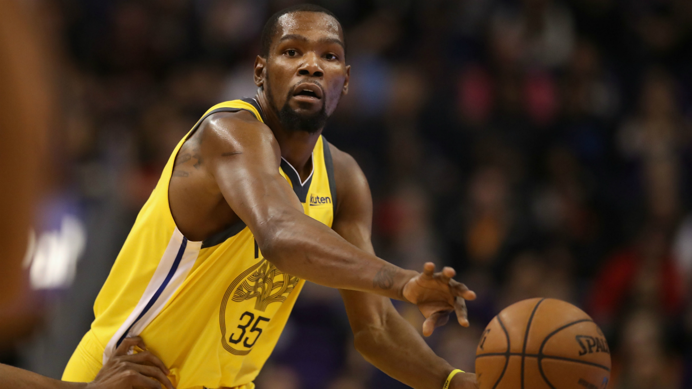
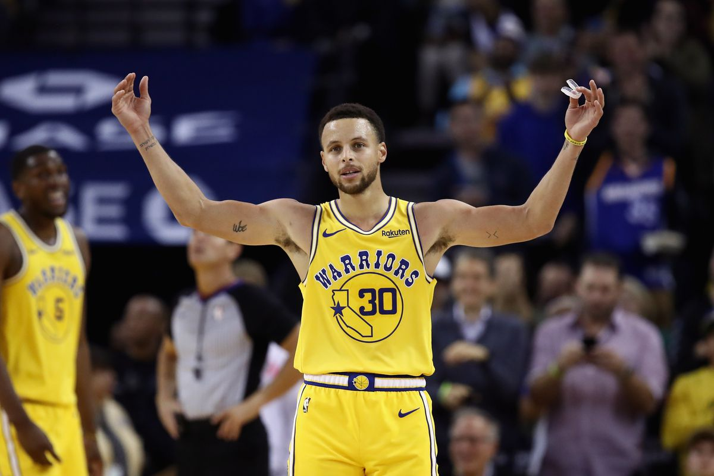
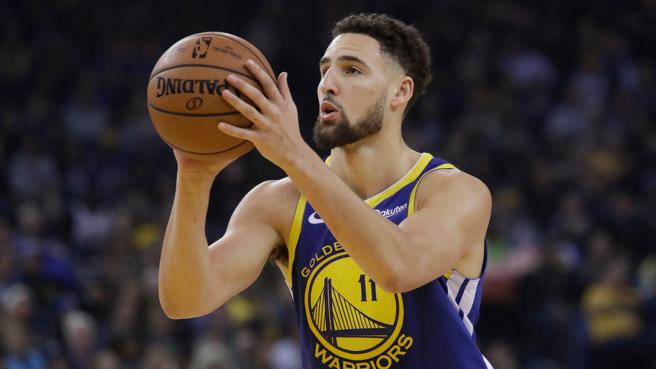
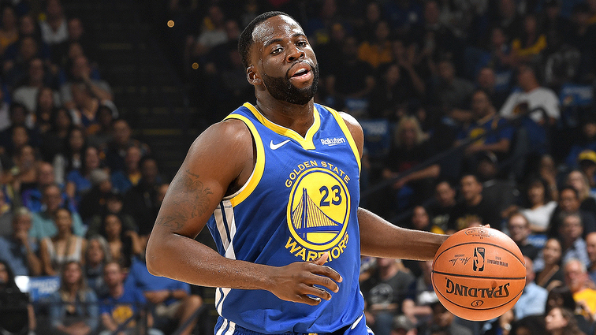
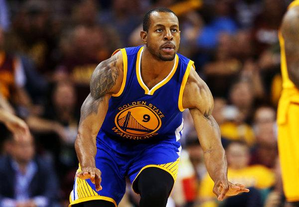
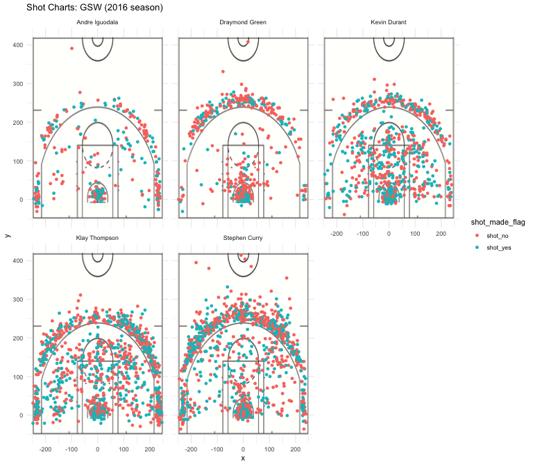

##### The Golden State Warriors have made a habit of bringing statistical impossibilities into reality. As Kevin Durant and Stephen Curry share the spotlight of leading Golden State to back-to-back NBA championships, it is easy to forget that the Warriors also employ many other best-performing shooters. Where do these current stars, including but not limited to Kevin Durant and Stephen Curry, outperform the others? In this article we present a close look at the shooting performance of some outstanding current Golden State Warriors players: Kevin Durant, Stephen Curry, Klay Thompson, Draymond Green and the last but not the least, Andre Iguodala.

## The Top Five Players

### Kevin Durant
Born on September 29, 1988 in Suitland, Maryland, just outside of Washington, D.C., Kevin Wayne Durant is a high-profile professional basketball player. After joining the Golden State Warriors in 2016, Durant led the team to back-to-back NBA championships:

In June 2017, he led the Warriors to victory over LeBron James and the Cleveland Cavaliers in the NBA finals, scoring 39 points in the Game 5 clincher to cement Golden State's second championship in three years. During the season, Durant averaged 35.2 points, 8.4 rebounds and 5.4 assists throughout the series, earning finals MVP honors for his performance. In 2018, Durant continued to show show his leadership when his celebrated teammate, two-time MVP Stephen Curry, suffered from knee injuries late in the season. Durant carried his team through the early rounds of the playoffs, and with Curry back to full strength, the Warriors swept the Cavaliers in their finals rematch. This year Durant successfully claimed his second straight finals MVP award.

```{r out.width='80%', echo=FALSE, fig.align='center'}

```

### Stephen Curry
Wardell Stephen Curry (born March 14, 1988), better known as Stephen Curry, is a professional American basketball player with the Golden State Warriors. The son of former NBA player Dell Curry, Stephen was drafted in 2009 by Golden State and eventually developed into one of pro basketball's top players with his stellar shooting skills. After garnering Most Valuable Player honors and helping the Warriors win the NBA championship in 2015, Curry led the team to a league-record 73 wins the following season. In May 2016, Curry became the first person to be named MVP by unanimous vote in NBA history, and one of only 11 players to win the MVP award two years in a row. He then helped the Warriors win the NBA title again in 2017 and '18, both times over the Cleveland Cavaliers.

```{r out.width='80%', echo=FALSE, fig.align='center'}

```


### Klay Thompson
Klay Alexander Thompson (born February 8, 1990)[1] is an American professional basketball player for the Golden State Warriors of the National Basketball Association (NBA). He is credited as one of the greatest shooters in NBA history. He is a five-time NBA All-Star, a two-time All-NBA Third Team honoree, and a three-time NBA champion.

Son of former NBA player Mychal Thompson, Klay was selected in the first round of the 2011 NBA draft by Golden State with the 11th overall pick. Three years later, Thompson and his teammate Stephen Curry set a then NBA record with 484 combined three-pointers in a season, earning the pair the nickname the "Splash Brothers". In the following year 2015, Thompson helped lead the Warriors to their first NBA Championship since 1975, and was a key contributor in the Warriors' 2017 and 2018 titles.

```{r out.width='80%', echo=FALSE, fig.align='center'}

```


### Draymond Green
Draymond Jamal Green Sr. (born March 4, 1990) is an American professional basketball player for the Golden State Warriors of the National Basketball Association (NBA). He went on to be drafted 35th overall in the 2012 NBA draft by the Golden State Warriors, and later played a key role on the Warriors' 2015, 2017 and 2018 championship teams.

Playing primarily at the power forward position, Green is a capable three-point shooter who provides spacing for the offense by stretching the opposing defense. He is a three-time NBA champion and a three-time NBA All-Star. In 2017, he won the NBA Defensive Player of the Year.

```{r out.width='80%', echo=FALSE, fig.align='center'}

```


### Andre Iguodala
On July 10, 2013, Iguodala officially joined the Golden State Warriors as part of a three-team trade involving the Denver Nuggets and the Utah Jazz. Previously an NBA All-Star, Iguodala soon made the game-winning, buzzer-beating shot in the Warriors' 116-115 win over the Oklahoma City Thunder on November 14. In 2015, he won an NBA championship with the Warriors and was named the NBA Finals Most Valuable Player. Iguodala helped the Warriors win two more championships in 2017 and 2018. He was also a member of the United States national team at the 2010 FIBA World Championship and 2012 Summer Olympics, winning the gold medal both times.

```{r out.width='80%', echo=FALSE, fig.align='center'}

```

## Effective Shooting Percentage of Top 5

Two-point, Three-point, and overall effective shooting percentage tables of the top 5 GSW players are presented below:

#### Two-Point Effective Shooting:

```{r setup, include=FALSE, echo=FALSE}
library(dplyr)
library(gridExtra)
df <- read.csv("../data/shots-data.csv", stringsAsFactors = FALSE)
df <- mutate(df, shot_yes_2pt = ifelse(shot_type == "2PT Field Goal" & shot_made_flag == "shot_yes", 1, 0))
df <- mutate(df, shot_yes_3pt = ifelse(shot_type == "3PT Field Goal" & shot_made_flag == "shot_yes", 1, 0))
df <- mutate(df, shot_2pt = ifelse(shot_type == "2PT Field Goal", 1, 0))
df <- mutate(df, shot_3pt = ifelse(shot_type == "3PT Field Goal", 1, 0))
```

```{r include=FALSE, echo=FALSE}
twopt <- filter(df, shot_type == "2PT Field Goal")
twopt <- summarise(group_by(twopt, name), total = sum(shot_2pt), made = sum(shot_yes_2pt))
twopt <- mutate(twopt, perc_made = made * 100.0 /total)
twopt <- arrange(twopt, desc(perc_made))
```

```{r include=FALSE, echo=FALSE}
threept <- filter(df, shot_type == "3PT Field Goal")
threept <- summarise(group_by(threept, name), total = sum(shot_3pt), made = sum(shot_yes_3pt))
threept <- mutate(threept, perc_made = made * 100.0 /total)
threept <- arrange(threept, desc(perc_made))
```

```{r include=FALSE, echo=FALSE}
totalpt <- summarise(group_by(df, name), total = sum(shot_2pt+shot_3pt), made = sum(shot_yes_2pt+shot_yes_3pt))
totalpt <- mutate(totalpt, perc_made = made * 100.0 /total)
totalpt <- arrange(totalpt, desc(perc_made))
```

2PT Effective Shooting Percentage of GSW Players:

```{r echo=FALSE, fig.align='center'}
knitr::kable(twopt, caption = "2PT Effective Shooting Percentage by Player")
```

All 5 players are capable Two-point shooters. Andre Iguodala gives a leading performance in making effective two-point shots. Records show that Iguodala made a total of 210 attempts of two-pointers, and 63 percent of them are successfully, giving a 134 made 2PT shots.

Kevin Durant gives a 60 percent effective 2PT shooting percentage, slightly lower than Andre Iguodala. During the seaon, Durant attempts a total of 643 shots, succeeds in 390 scores. 

Stephen Curry and Klay Thompson both have an effective 2PT shooting percentage a little above 50% but less than 55%. Within 2016 both scored more than 300 2-points.

Draymond Green's effective shooting percentage is 49.42%, slightly lower than the other four players. 

#### Three-Point Effective Shooting:

3PT Effective Shooting Percentage of GSW Players:

```{r echo=FALSE, fig.align='center'}
knitr::kable(threept, caption = "3PT Effective Shooting Percentage by Player")
```

Among the top 5 players, Klay Thompson is the best-performing three-pointer shooters, giving a 43.41% effective shooting rate. Stephen Curry, with an effective shooting rate of 40.75%, scores the most number of three points. Kevin Durant, Andre Iguodala gives a effective shooting rate of 38.60% and 26.02% respectively. Draymond Green, despite of having the least effective shooting rate, scores 74 three-points during the season.


#### Overall Effective Shooting:

(Overall) Effective Shooting Percentage of GSW Players:

```{r echo=FALSE, result='asis', fig.align='center'}
knitr::kable(totalpt, caption = "Effective Shooting Percentage by Player")
```

Overall speaking, Kevin Durant makes the lead with his 54.10% effective shooting rate of both three-point and two-point. Andre Iguodala follows the lead with a 51.75% rate. Stephan Curry andKlay Thompson, with an effective shooting percentage a little less than 50%, score the most and 2nd-most number of shots during the series in 2016. Draymond Green, at the power forward position, scores 245 points, giving an effective shooting percentage of 42.39%. 

#### Shot Charts

A facetted shot chart is included below to give a visual demonstration of the shooting performance of the five selected players. 
```{r out.width='80%', echo=FALSE, fig.align='center'}

```

From the chart it is observable that all five players demonstrate remarkable effective shooting percentages. 

Kevin Durant, Stephen Curry and Klay Thompson are more experienced players and they overall have a better performance in scoring both two-point and three-point. 

Andre Iguodala has a better performance in scoring two-points than three-points. Draymond Green, despite of showing a statistics not so good as the others, still demonstrates notable acheievements in scoring points. 

## Conclusion

It is difficult and almost impossible to decide the best shooter from the five selected players: Andre Iguodala has the highest 2PT effective shooting rate whereas Kevin Durant scores the maximum number of two points. Similarly, Klay Thompson takes a lead on Three-point effective shooting rate and Stephan Curry has the most number of scored three point. Despite of lower statistics, Draymond Green as a power forward, does his job to stretch the opposing defense and likely provide opportunities for his teammates to attempt at shooting. Each of them is exceptional player and together as a team they are able to make Golden State Warriors one of the best team for all time. 

## Reference
https://www.biography.com/people/kevin-durant-20929909

https://www.biography.com/people/stephen-curry

https://en.wikipedia.org/wiki/Klay_Thompson

https://en.wikipedia.org/wiki/Andre_Iguodala

https://en.wikipedia.org/wiki/Klay_Thompson


