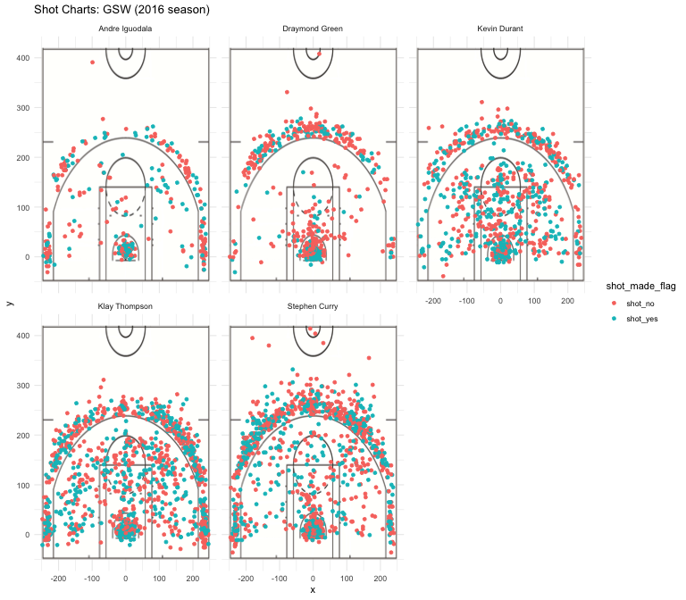

Top Players that Make The Warriors Great
================
Peijie Li

The Golden State Warriors have made a habit of bringing statistical impossibilities into reality. As Kevin Durant and Stephen Curry share the spotlight of leading Golden State to back-to-back NBA championships, it is easy to forget that the Warriors also employ many other best-performing shooters. Where do these current stars, including but not limited to Kevin Durant and Stephen Curry, outperform the others? In this article we present a close look at the shooting performance of some outstanding current Golden State Warriors players: Kevin Durant, Stephen Curry, Klay Thompson, Draymond Green and the last but not the least, Andre Iguodala.

Motivation
----------

Background & Data
-----------------

Include an overview of each player Include Statistics

Analysis
--------

Include overall chart and table. Compare them Compare shot skills for 2PT, 3PT and overall

2PT Effective Shooting Percentage of GSW Players:

| name           |  total|  made|  perc\_made|
|:---------------|------:|-----:|-----------:|
| Andre Iguodala |    210|   134|    63.80952|
| Kevin Durant   |    643|   390|    60.65319|
| Stephen Curry  |    563|   304|    53.99645|
| Klay Thompson  |    640|   329|    51.40625|
| Draymond Green |    346|   171|    49.42197|

3PT Effective Shooting Percentage of GSW Players:

| name           |  total|  made|  perc\_made|
|:---------------|------:|-----:|-----------:|
| Klay Thompson  |    580|   246|    42.41379|
| Stephen Curry  |    687|   280|    40.75691|
| Kevin Durant   |    272|   105|    38.60294|
| Andre Iguodala |    161|    58|    36.02484|
| Draymond Green |    232|    74|    31.89655|

(Overall) Effective Shooting Percentage of GSW Players:

| name           |  total|  made|  perc\_made|
|:---------------|------:|-----:|-----------:|
| Kevin Durant   |    915|   495|    54.09836|
| Andre Iguodala |    371|   192|    51.75202|
| Klay Thompson  |   1220|   575|    47.13115|
| Stephen Curry  |   1250|   584|    46.72000|
| Draymond Green |    578|   245|    42.38754|

Conclusion
----------

Reference
---------

Include a reference of where data is from.
