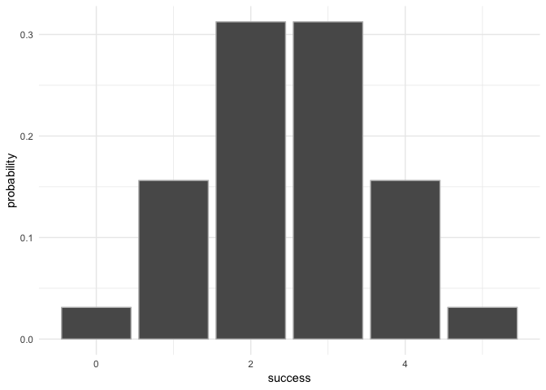
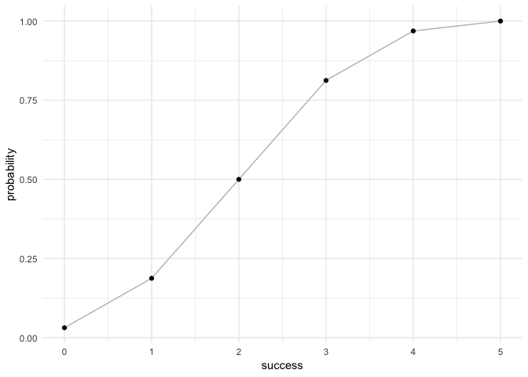

<!-- README.md is generated from README.Rmd. Please edit that file -->
Overview
--------

`"binomial"` is a minimal implementation for calculating probabilities of a Binomial random variable, and related calculations such as the probability distribution, the expected value, variance, etc, and to visualize the probability distribution.

-   `bin_variable()` prints the content of a binomial object
-   `bin_probability`, `bin_distribution` and `bin_cumulative` calculates probability distribution of given binomial variable.
-   `bin_mean`, `bin_variance`, `bin_mode`, `bin_skewness` and `bin_kurtosis` calculates summary measures for a given binomial object.
-   `summary()` method for a binomail variable.
-   `plot()` method for a binomial probability distribution.

Motivation
----------

This package has been developed to illustrate basic calculations of a Binomial variable.

Installation
------------

Install the development version from GitHub via the package `"devtools"`:

``` r
# development version from GitHub:
#install.packages("devtools") 
# install "binomial" (without vignettes)
devtools::install_github("PeijieLi/binomial")
# install "binomial" (with vignettes)
devtools::install_github("PeijieLi/binomia", build_vignettes = TRUE)
```

Usage
-----

``` r
library(binomial)

# compute the probability of a binomail distribution
dis1 <- bin_probability(success = 2, trials = 5, prob = 0.5)
plot(dis1)
```



``` r
# compute the probability distribution of a binomial distribution
bin_distribution(trials = 5, prob = 0.5)
#> Warning in if (k > n) stop("k cannot be greater than n"): the condition has
#> length > 1 and only the first element will be used
#>   success probability
#> 1       0     0.03125
#> 2       1     0.15625
#> 3       2     0.31250
#> 4       3     0.31250
#> 5       4     0.15625
#> 6       5     0.03125

# compute the cumulative probability distribution of a binomial distribution
dis2 <- bin_cumulative(trials = 5, prob = 0.5)
#> Warning in if (k > n) stop("k cannot be greater than n"): the condition has
#> length > 1 and only the first element will be used
plot(dis2)
```



``` r

# construct a binomial object with given parameters
bin1 <- bin_variable(trials = 5, prob = 0.45)
binsum1 <- summary(bin1)
binsum1
#> "Summary Binomial"
#> 
#> Parameters
#> - number of trials: 5
#> - prob of success: 0.45
#> 
#> Measures
#> - mean: 2.25
#> - variance: 1.2375
#> - mode: 2
#> - skewness: 0.0898933149950989
#> - kurtosis: -0.391919191919192
```
